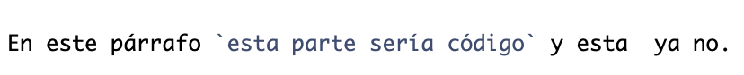
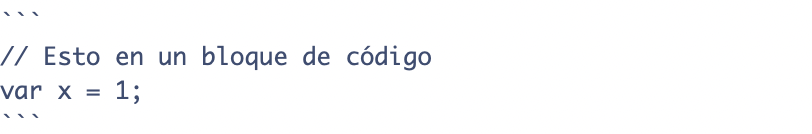

```{r setup, include=FALSE}
knitr::opts_chunk$set(echo = FALSE)
```


```{css, echo = FALSE}
/* From https://github.com/yihui/xaringan/issues/147  */
.scroll-output {
  height: 80%;
  overflow-y: scroll;
}
/* https://stackoverflow.com/questions/50919104/horizontally-scrollable-output-on-xaringan-slides */
pre {
  max-width: 100%;
  overflow-x: scroll;
}
```


## Contenido

1. ¿Qué es Markdown?  
2. Lenguaje de marcado  
2.1 Encabezados    
2.2 Formatos (negritas, cursiva, )  
2.3 Listas  
2.4 Código  
2.5 Links  
2.6 Imágenes  
2.7 Tablas  

---
## Objetivo
Al finalizar la lección, el alumno podrá usar lenguaje de marcado __markdown__ para la generación de documentación.

---
## Documentación de Software 

.content-box-blue[
La documentación del software es el proceso de creación de documentación para el software con el fin de hacerlo más **intuitivo y fácil de usar**. Es un documento que contiene información general sobre **cómo se ha creado el software, cómo funciona y otros detalles**. 

]

```{r rmarkdown, echo=FALSE, out.width='70%', fig.align='center', fig.cap='Ciclo de desarrollo de Software'}
knitr::include_graphics("https://media.web.userguiding.com/uploads/2022/01/22011613/what-is-software-documentation-2048x684.jpg")
```

.tiny[
[6 Herramientas de Documentación de Software by Alican Bektas ](https://userguiding.com/es/blog/herramientas-documentacion-software/#ftoc-heading-9)
]

---
## Documentación de Software 

Vimos que **Un portafolio de proyectos** del programador Profesional debe incluir al menos un **README** que describa lo que hace y como se usa el software.

Si deseas **controlar y versionar la documentación**, git controla archivos de texto plano (no binarios .docx), por eso necesitamos crear la documentación en texto, pero que sea fácil de leer y bonito.

---
## ¿Qué es Markdown?  

__Markdown__ es un lenguaje de marcado ligero que permite agregar formatos como encabezados, negritas, cursivas, listas, etc., a un texto sin formato. Representa un sistema de escritura minimalista con el que podemos escribir sin muchas preocupaciones, y que puede ser exportado a otros formatos con facilidad.  

Tiene una sintaxis más simple que HTML, con markdown no hay que preocuparse por abrir y cerrar etiquetas.  

Su adaptabilidad y facilidad de manejo lo convierte en una herramienta de poderosa legibilidad, usada por GitHub.  

---
## ¿Qué es Markdown?  


__Ventajas de usar Markdown__  

- Escribir para web es más rápido y cómodo. Una vez que te acostumbras y conoces la sintaxis, completas el texto más rápido.  

- Facilidad de uso debido a la sintaxis que emplea.  

- Es más difícil cometer errores de sintaxis.  

- Es perfecto para usarlo con editores de texto minimalistas.  

- Puede compartirse fácilmente entre computadoras, entornos moviles, etc., quedando resuelto de este modo la incomodidad de dar formato a un texto a través de los sistemas  diferentes sistemas donde se encuentre.  

---
## Editores para Markdown

_Windows_

- MarkdownPad
- DownMarker 
- MarkPad
- Laverna
- Joplin

_MacOS_  

- Typora
- MacDown

_Linux_  

- Springseed
- Remarkable


---
## Encabezados 

Para inidicar en cabezaados/títulos y subtítulos en nuestro documento se hace uso del caracter # al inicio del texto. Por cada # se interpretará como un nivel distinto, por ejemplo:

Sintaxis: `# Título`   
# Título  

Sintaxis: `## Subtítulo`   
## Subtítulo  


Sintaxis: `### Sub-subtítulo`   
### Sub-subtítulo  

---
## Formatos (negritas, cursiva, citas) 

Para poner formato a nuestros documento haremos uso de:  


Sintaxis: `**texto en negritas**`  
**texto en negritas**  

Sintaxis: `*texto en cursivas*`  
*texto en cursivas*

Sintaxis: `> cita` 
> Texto de la cita    

---
## Listas

Las **listas desordenadas** se colocan con un guión al principio de la línea.

Sintaxis:  

`- Elemento`  
`- Otro elemento`  
`- Otro más`  

- Elemento
- Otro elemento
- Otro más  


---
## Listas 


Las **listas ordenadas** se colocan con el índice numérico seguido de un punto.   

Sintaxis:  

`1. Primer elemento`  
`2. Segundo elemento`  
`3. Tercer elemento`  


1. Primer elemento
2. Segundo elemento
3. Tercer elemento

---
## Código 

Markdown permite insertar líneas o bloques de código mediante el caracter de acento invertido.  

Sintaxis (línea):  

```{r, out.width = "450px",fig.align='center'}

```

En este párrafo `esta parte sería código` y esta  ya no.  

Sintaxis (bloque): Si el bloque incluye una o varias líneas de código, se deben colocar tres caracteres de acento invertido seguidos de un salto de línea.  

```{r, out.width = "450px",fig.align='center'}

```


```
// Esto en un bloque de código
var x = 1;
```


---
## Links

Los enlaces se generan mediante corchetes y paréntesis. Pimero se indica el texto del enlace entre corchetes y luego la URL entre paréntesis.  

Sintaxis:  

Aquí puedes consultar el sitio del `[CCG](https://www.www.unam.mx/)`  

Aquí puedes consultar el sitio del [CCG](https://www.ww.unam.mx/)  


Si queremos convertir una URL en un enlace, se coloca dentro de caracteres menor qué y mayor qué <>.

Sintaxis:  

`<https://www.ccg.unam.mx/>`  

<https://www.ccg.unam.mx/>


---
## Imágenes

Podemos insertar imagenes existen diferentes alternativas:  

1) Indicando entre corchetes un texto de identificación de la imagen, seguido de parentesis con la URL de la imagen y entre comillas el texto que queremos aparezca al poner el cursor sobre la imagen.  

Sintaxis:  

``  


---
## Imágenes

Otra alternativa es indicando la dirección de una imagen que tengamos en nuestra computadora:  

Sintaxis:  

``  


  
__IMPORTANTE:__ Recuerda agrupar tus archivo markdown e imágenes una carpeta para tener todo en un solo lugar.  


Una opción más usando código HTML para poder definir el tamaño de la imagen:  

Sintaxis:  

``  


---
##  Tablas

Para agregar una tabla, se usan guiones \--- para crear el encabezado de cada columna y barras verticales \| para separar cada columna. 

Sintaxis:  

```
| Columna 1   | Columna 2   |
| ----------- | ----------- |
| Texto       | Text        |
| Texto       | Text        |
```  


| Columna 1   | Columna 2   |
| ----------- | ----------- |
| Texto       | Text        |
| Texto       | Text        |

__Nota:__ También podemos usar un __Generador de tablas en Markdown__ <https://www.tablesgenerator.com/markdown_tables>

---
## Conclusión 

Haciendo uso del lenguaje Markdown podemos crear documentos, en texto plano, con distintos estilos Además, podemos exportarlos a diferentes formatos como PDF, HTML, Word, etc.


 


---
## Práctica

- El template del archivo README, modificalo para que use el formato markdown. convierte las secciones a títulos y agrega otras etiquetas. Salva el template como `README.md`


