```{r setup, include=FALSE}
knitr::opts_chunk$set(echo = FALSE)
```


```{css, echo = FALSE}
/* From https://github.com/yihui/xaringan/issues/147  */
.scroll-output {
  height: 80%;
  overflow-y: scroll;
}
/* https://stackoverflow.com/questions/50919104/horizontally-scrollable-output-on-xaringan-slides */
pre {
  max-width: 100%;
  overflow-x: scroll;
}
```

## Contenido

1. Introducción  
2. Controlador de versiones  
3.  Git  
4. Comenzando a trabajar con Git  
4.1. Instalar y configurar Git  
4.2. Esquema de trabajo de Git  
4.3. Crear un repositorio  
4.4. Inicializar repositorio  
4.5  Crear un programa y agregarlo a git  
4.6. Commit  
 
---

# Git

## Objetivo
Al finalizar la lección, podremos llevar el control de las modificaciones que realicemos en nuestros programas, así como identificar cuáles fueron los cambios realizados y las fechas en que ocurrieron, todo esto haciendo uso de *Git* como controlador de versiones.


---

## Introducción
__Vamos a comenzar a hacer software, pero… ¿qué queremos lograr con el desarrollo de software?__

- Resolver algún problema  

- Que nuestro código pueda ser utilizado por otras personas  

- Que el software sea fácil de entender por mi y por los demás  

- Que sea fácil realizar modificaciones  

- ¡Colaborar con más gente!  

---

## Introducción  

__Para lograrlo necesito...__

- Utilizar estándares de codificación  
  - PEP8 para Python  
  - Guías de estilo de Google https://google.github.io/styleguide/   


- Utilizar notaciones o estándares de nombrado  
  - Camel case  
  - Upper case  

- Buenas prácticas  
  - Encabezado de programas  
  - Documentación interna  
  - Nombrado adecuado de variables y métodos/funciones  
  - Nombrado adecuado de los programas  
  - Organización adecuada del código (carpetas y archivos)  
  - Compartir el código con mis compañeros para obtener retroalimentación  

- *Control de versiones del código*  


---

## Control de versiones

```{r, out.width = "750px",fig.align='center'}
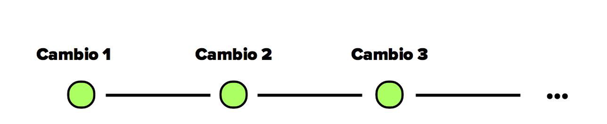
```

---

## Control de versiones 

```{r, out.width = "400px",fig.align='center'}
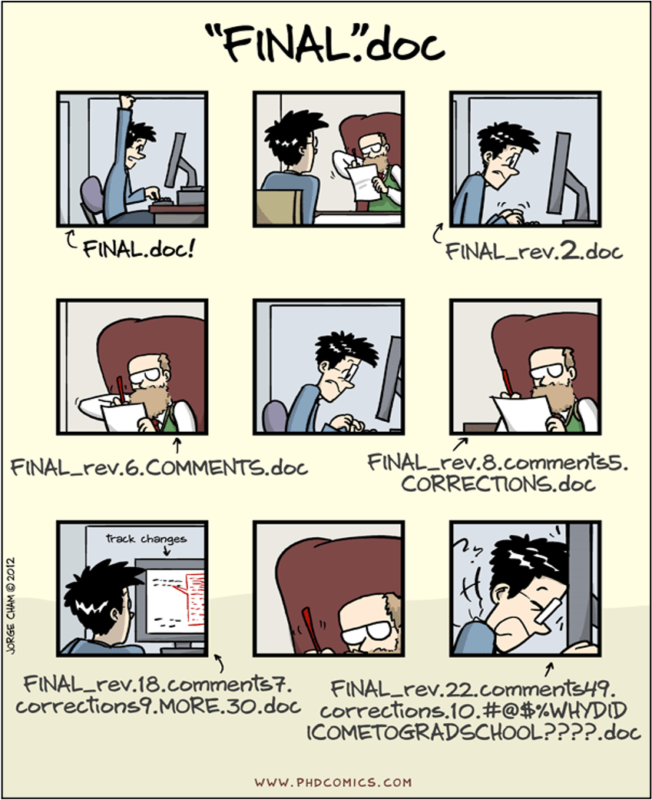
```

---

## Control de versiones 

```{r, out.width = "450px",fig.align='center'}
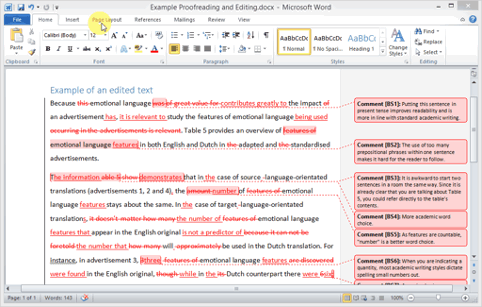
```

---

## ¿Cómo puedo controlar mi código? 

__Forma manual__

El versionamiento está constituido por dos dígitos, versiones primarias y secundarias (X.Y).

```{r, out.width = "150px",fig.align='right'}
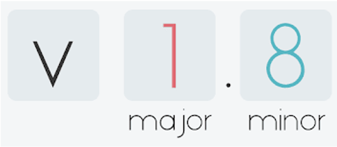
```

Reglas:

```{r, out.width = "650px",fig.align='left'}
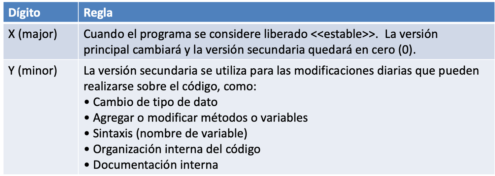
```

---


## ¿Cómo puedo controlar mi código? 

__Forma manual__ 

Aplicando las reglas...  

- Agregar línea de código (algunos print, comentarios internos):   myScript_v0.1.py  

- Cambiar el nombre de una variable:                               myScript_v0.2.py  

- Borrar varias funciones del código:                              myScript_v1.0.py  

- Agregar un método:                                               myScript_v2.0.py  


---


## ¿Cómo puedo controlar mi código? 

__Forma automática__  
Por medio de un sistema de control de versiones.  

```{r, out.width = "450px",fig.align='center'}
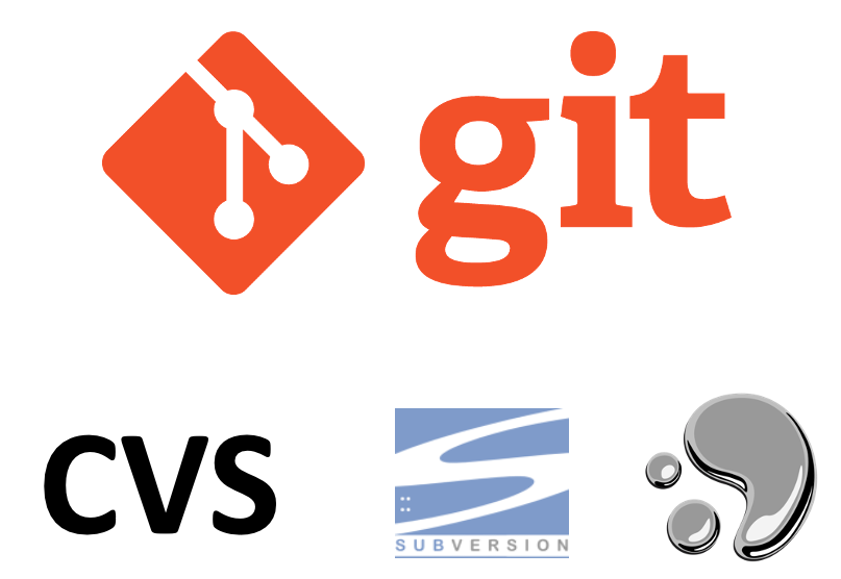
```
    

---

## ¿Cómo puedo controlar mi código? 

Un sistema de control de versiones es una herramienta que se encarga por nosotros de __controlar__ todos los cambios que realicemos en nuestros programas, creando __diferentes versiones de nuestros archivos__.  

Además, nos permite decidir cuales cambios serán aplicados para la siguiente versión (cada registro de estos cambios es llamado como _commit_), incluyendonmetadatos acerca de ellos.  

Los sistemas de control de versiones no son nuevos. Herramientas como CVS, o Subversion han estado presentes desde inicios de 1980. Sin embargo, estos han sido considerados anticuados debido a limitaciones en sus capacidades. Actualmente, existen modernos sistemas como Git y Mercurial, que incluyen poderosas herramientas para el trabajo colaborativo y concurrente en los archivos. 


---

## ¿Cómo puedo controlar mi código? 

- Usar un sistema de control de versiones es como si tuvieramos un “undo” o “deshacer” ilimitado.  

- Un sistema de control de versiones también permite que muchas personas trabajen en paralelo.  

```{r, out.width = "250px",fig.align='right'}

```

---

## Pero… ¿qué es Git?

- Es un sistema de control de versiones para _rastrear los cambios de nuestro código_ durante el desarrollo del software.  

- Está diseñado para coordinar el trabajo entre los programadores o contribuidores.  


```{r, out.width = "250px",fig.align='right'}
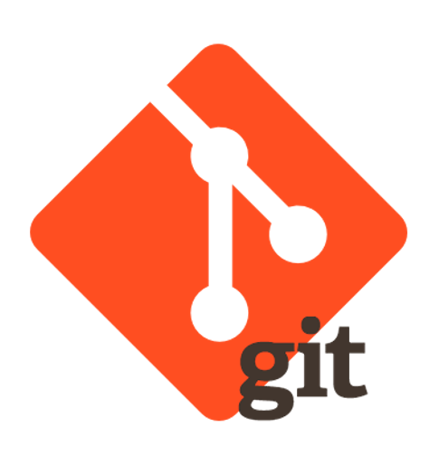
```

---

## ¿Cómo trabajo con Git? 

__Git de manera local:__  
- Solo yo puedo tener acceso al código  
- Puedo controlar en mi computadora los cambios que haga al código  
- Mi software se vuelve solo de uso personal  

__Git + GitHub:__ 
- Permitiendo trabajar conjuntamente en una idea  
- Formar una comunidad de varias personas trabajando en un fin común  
- Contribuir a mejorar el código  
- Acceso al código, leerlo, estudiarlo y aprender de él, e incluso hacer cambios y experimentar sin afectar el código original  


---


## Trabajando con Git y GitHub 

```{r, out.width = "750px",fig.align='center'}
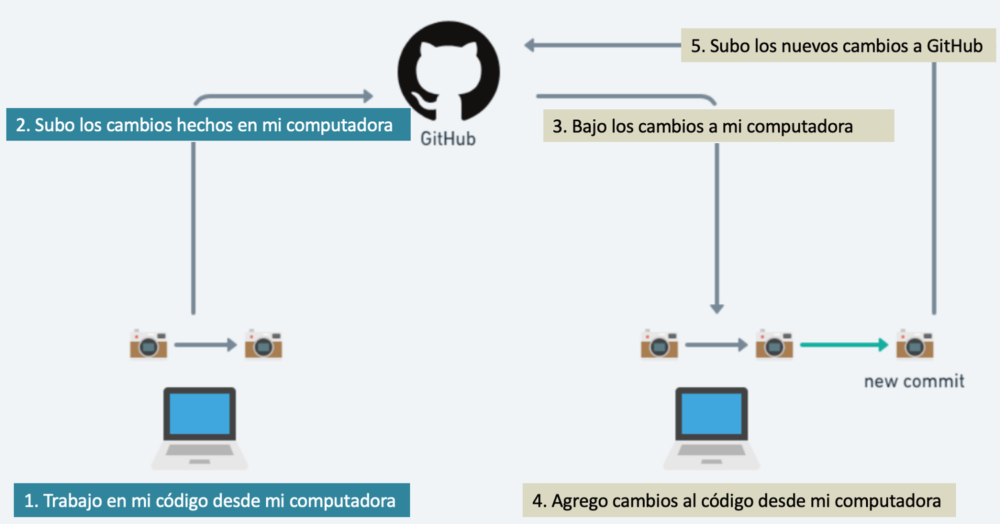
```

---

## Comenzando a trabajar con Git 

1. Instalar y configurar Git  
2. Esquema de trabajo de Git  
3. Crear un repositorio  
4. Inicializar repositorio  
5. Crear un programa y agregarlo a git  
6. Commit  
7. Explorando el historial  
8. Comparando archivos  
9. Ignorando archivos  
.  

```{r, out.width = "450px",fig.align='center'}
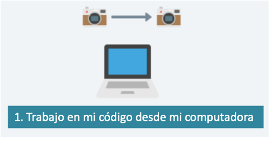
```

---

## Instalación de Git 

Revisar si Git está instalado  

- Abrir una terminal (símbolo del sistema en windows):  
- Ejecutar el comando:  

`git --version`  

Si Git no está disponible...  

_Windows:_  <https://gitforwindows.org/>  

_MacOS:_ <https://git-scm.com/download/mac>   

_Linux:_ 
Debian/Ubuntu: `sudo apt-get install git`  
Fedora: `sudo dnf install git`


---

## Crear cuenta de usuario en GitHub

- Ir a la dirección: <https://github.com>  

----- Nombre de usuario  
----- Correo electrónico  
----- Contraseña  

*Verificar cuenta de correo electrónico  


---

## Configuración de Git

Definiendo mi nombre y correo electrónico:  

`git config --global user.name ”tuNombre”`  

git config --global user.name "shirleyah"  

`git config --global user.email tuEmail`  

git config --global user.email shirley.alquicira@gmail.com  


El username e email estarán asociados a las siguientes actividades con Git, así como con la interacción GitHub, por lo que se sugiere que el email que se defina sea el mismo que se utilice al momento de crear nuestra cuenta de GitHub.

Para ver los valores de configuración de Git:  
`git config --list`


---


## Esquema de trabajo de Git


```{r, out.width = "650px",fig.align='center'}
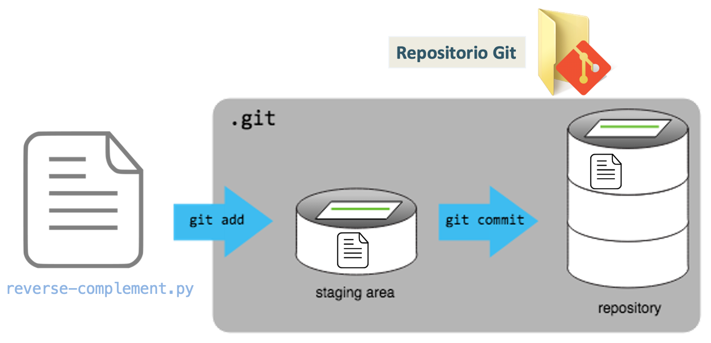
```

_Repositorio_: carpeta que contiene el seguimiento de los cambios que se realicen en el código. 

---

## Creando un repositorio controlado por Git

- Entrar a la carpeta de trabajo  
`cd chat–gpt-app`  


__Buenas prácticas__  
Seguir una estructura de organización de carpetas y archivos para nuestros proyectos.

```{r, out.width = "650px",fig.align='center'}
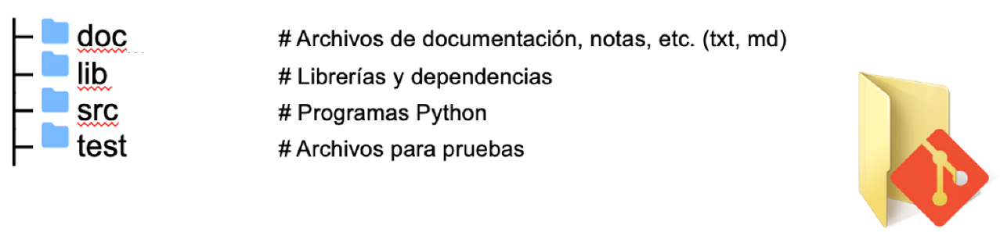
```


---

## Creando un repositorio controlado por Git

- Inicializar el repositorio Git  
`git init`  

- Revisar el repositorio  
`ls -la`  

- Comprobar repositorio  
`git status`  

```{r, out.width = "750px",fig.align='center'}
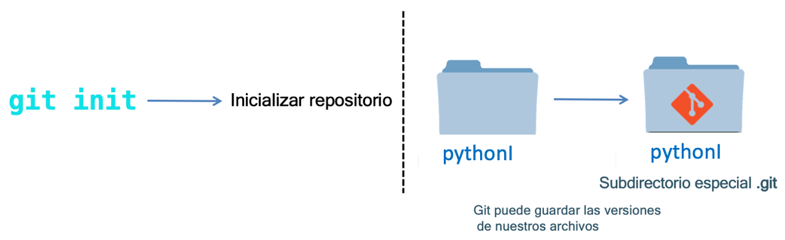
```


---

##  Actividad

Imaginemos que dentro del directorio `chat–gpt-app`:

\# Creamos un sub-directorio llamado analysis  
`$ mkdir analysis`  

\# Vamos al directorio analysis  
`$ cd analysis`  

\# Inicializamos un repositorio Git  
`$ git init`  


__¿Les parece que esta sea una buena idea?__

```{r, out.width = "200px",fig.align='left'}

```


---

## Creando un repositorio controlado por Git

`git init` inicializa un repositorio Git.


Git almacena y controla todos los cambios que se hagan en el contenido del repositorio mediante el directorio `.git`

```{r, out.width = "150px",fig.align='center'}

```

---

##  Controlando los cambios con Git

1.  Entrar al directorio  			
`cd chat–gpt-app`

2. Entrar a la carpeta src  

3. Editar el programa: __chatgpt-api.py__. Cambiar el contexto por <<<<>>>>>>>>  

4. Indicar a Git que controle los cambios de mi programa  
`git add chatgpt-api.py`

5. Confirmar los cambios realizados  		
`git commit –m “Mensaje”`


---

##  Controlando los cambios con Git

```{r, out.width = "750px",fig.align='center'}
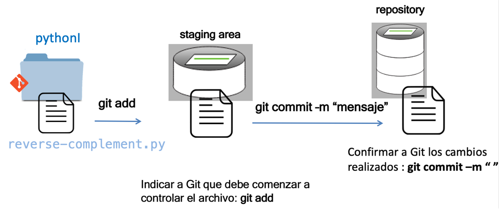
```

---

## Resumen

- Git: sistemas de control de versiones  
- Esquema de trabajo de Git  
```{r, out.width = "450px",fig.align='center'}
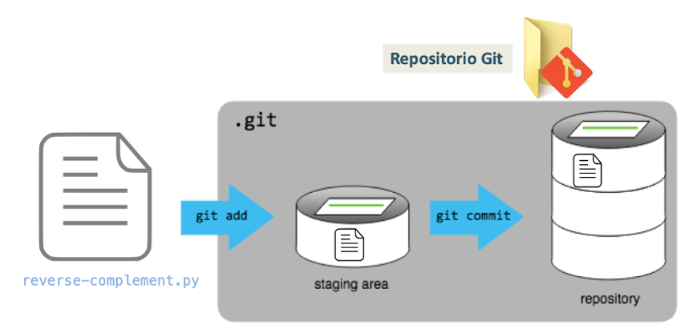
```

__Comandos Git:__

`git init` inicializar repositorio Git

`git add` agregar y dar seguimiento a los archivos del repositorio Git

`git commit –m “Mensaje”` Formalizar/asegurar los cambios realizados en el repositorio


---

## Algunas preguntas...

__¿Una vez creado el repositorio Git puedo moverlo a una nueva ubicación?__  

Si, mientras el directorio .git no se vea afectado, Git seguirá controlando los cambios en el repositorio sin importar que se haya movido a otro lugar.  


__¿Puedo modificar el mensaje de un commit?__  

Si. Puedes podificar el mensaje del commit más reciente:

`git commit --amend -m ”Mensaje”`


---

## Historial de versiones (commits)

`git log` lista todos los commits realizados en el repositorio en orden cronológico inverso.  

`git log –N` donde N indica el número de commits que queremos obtener.  

```{r, out.width = "650px",fig.align='center'}
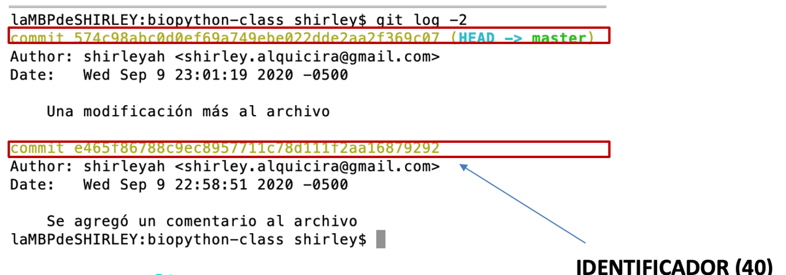
```


---

## Historial de versiones (commits)

`git log --oneline` información reducida  

```{r, out.width = "650px",fig.align='center'}
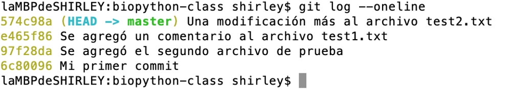
```

---

## ¿Cómo identifico el estado de mi repositorio Git?

`git status`  

indica el estado de los archivos que pueden ser controlados por Git, o aquellos que ya están controlados pero se han modificado.


---

## Actividad

1. Editar el programa: __chatgpt-api.py__. Cambiar las descripciones del menú presentado en **table.add_row**   

2. Conocer el estado del repositorio  
`git status` 

3. Identificar archivos sin seguimiento  
`git status -u`  

4. Indicar a Git que controle los cambios de mi programa  
`git add chatgpt-api.py`

5. Confirmar los cambios realizados  		
`git commit –m “Mensaje”`


---

## ¿Cuándo restaurar una versión?  

Revisar el estado del repositorio  
`$ git status` 

Identificando los cambios realizados  
`$ git diff [#commit] chatgpt-api.py` 

Restaurar el programa al commit anterior  
`git checkout [IdCommit] chatgpt-api.py`


---

## Ignorando archivos

**¿Qué pasa si hay archivos que no quiero controlar?**  

Por ejemplo, archivos de respaldo creados automáticamente por nuestro editor, por el sistema operativo, o aquellos archivos de prueba creados durante el análisis de nuestros datos, archivos de configuración (passwords)...  

**Archivo:    .gitignore**

Crear directorio y archivos de prueba  
`$ mkdir results`  
`$ touch a.dat b.dat c.dat results/a.out results/b.out`  
Comprobando el estado de nuestro repositorio  
`$ git status`  
Creando archivo .gitignore en el directorio raíz  
`$ nano .gitignore`  
Agregar las líneas:  
`*.dat`   
`results/`  
Comprobando el estado de nuestro repositorio  
`$ git status` 

---

## Actividad

Dado un archivo .gitignore con el siguiente contenido  

`*.data`  
`!*.data`  

¿Cuál sería el resultado?  

El modificador ! negará la primera instrucción en el archivo .gitignore, por lo que todos los archivos .data serán controlados.  


---

## Resumen

__git add__: pone los archivos al área de preparación (staging area)  

__git commit__:guarda el contenidos del área de preparación como un nuevo commit en el repositorio local. Indicando por medio de un mensaje los cambios realizados

__git status [-u]__:muestra el estado del repositorio, indicando los archivos que pueden ser guardados/controlados en el directorio de trabajo, archivos que pueden pasar al área de preparación y aquellos archivos que pueden pasar al repositorio

__git log__: lista todos los commits realizados en el repositorio  

__git diff__: Comparar un archivo vs un commit en particular  

__git checkout__: Restaurar una versión  
 
 
```{r, out.width = "100px",fig.align='right'}

```


---
