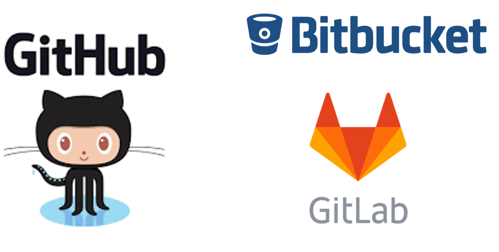
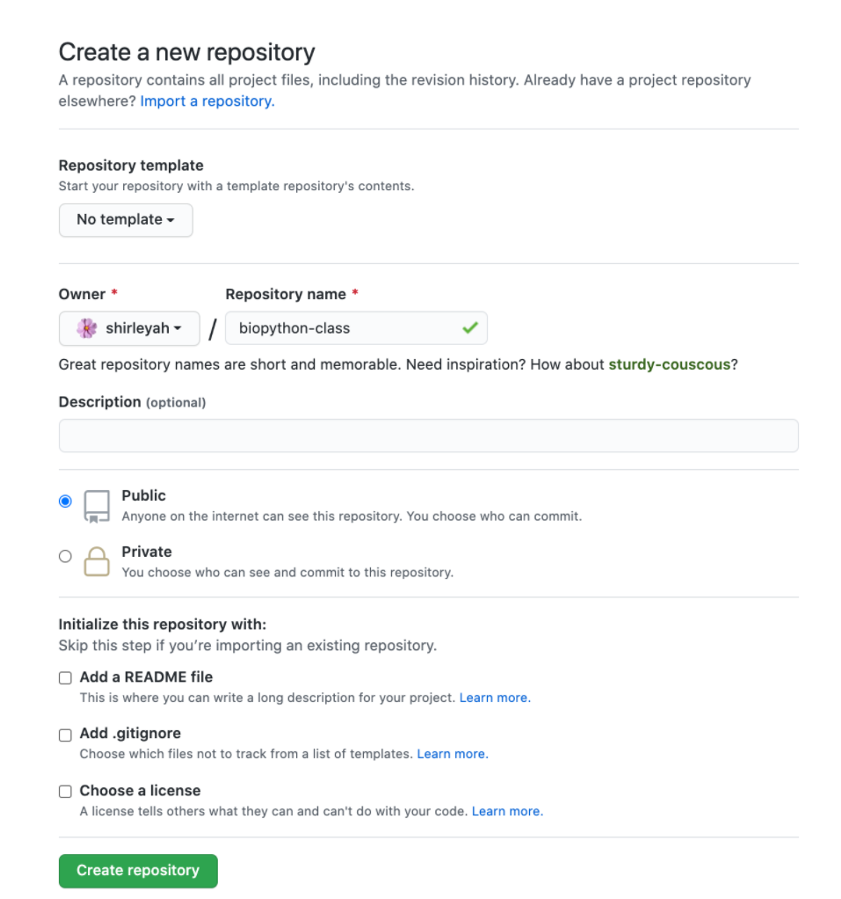
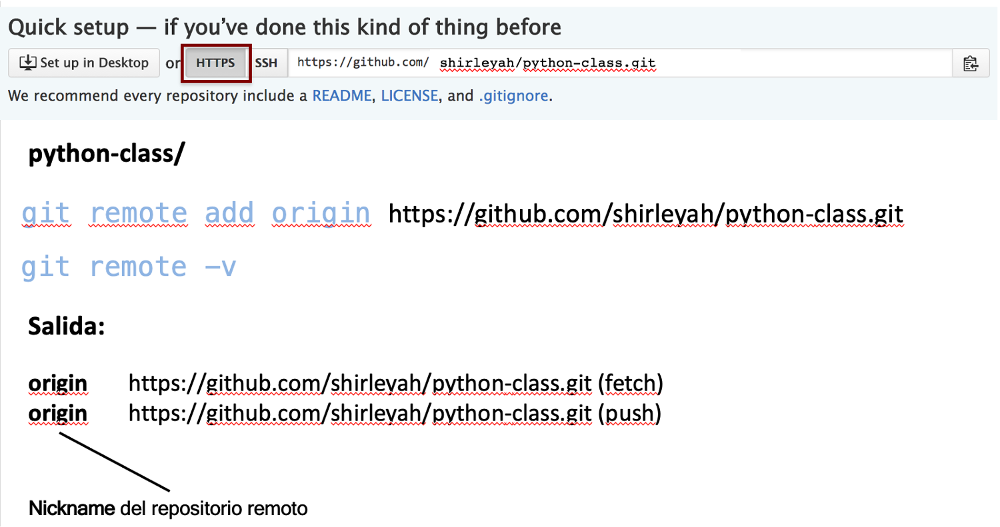
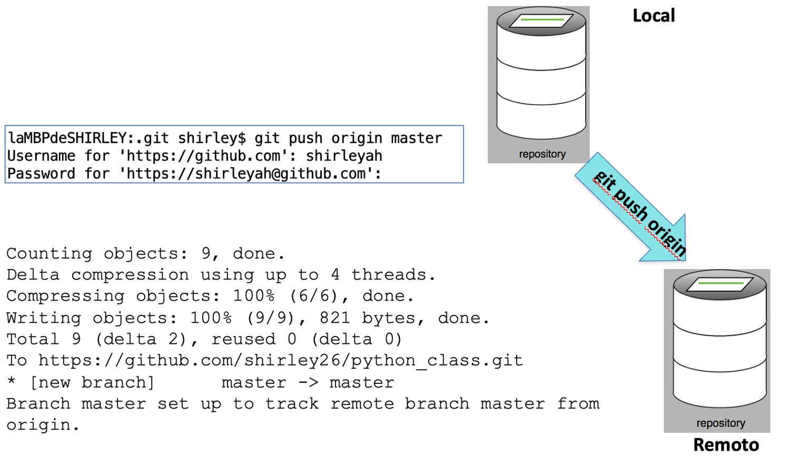
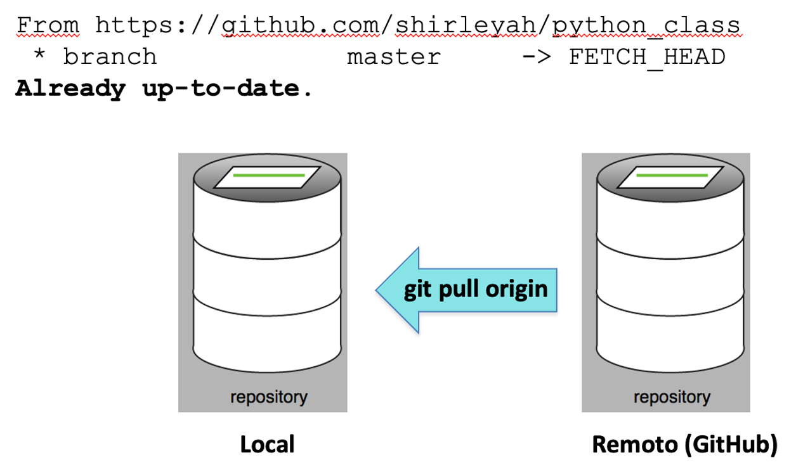

```{r setup, include=FALSE}
knitr::opts_chunk$set(echo = FALSE)
```


```{css, echo = FALSE}
/* From https://github.com/yihui/xaringan/issues/147  */
.scroll-output {
  height: 80%;
  overflow-y: scroll;
}
/* https://stackoverflow.com/questions/50919104/horizontally-scrollable-output-on-xaringan-slides */
pre {
  max-width: 100%;
  overflow-x: scroll;
}
```

## Contenido

1. Introducción  
2. Comandos básicos: push, pull  
3. GitHub Desktop  

 
---

# GitHub

## Objetivo
Al finalizar la lección, conoceremos parte del funcionamiento de GitHub y podremos enlazar nuestros repositorios locales para tenerlos en la nube, o bien, hacerlos disponibles para el público.  


---

## Servicios de Hosting

```{r, out.width = "600px",fig.align='center'}

```


---

## GitHub

**GitHub** es una plataforma web que permite alojar proyectos basados en Git, haciendo más fácil a los desarrolladores compartir el código.

```{r, out.width = "300px",fig.align='center'}

```

---

## GitHub

- Crear cuenta de usuario  
- Crear nuevo repositorio  
- Conectar dos repositorios  
- Push  
- Pull  
- Pull request  

---

## Crear nuevo repositorio


```{r, out.width = "500px",fig.align='center'}

```

---

## Conectar dos repositorios


```{r, out.width = "800px",fig.align='center'}

```

---

## _Push_ : llevando los cambios al servidor remoto

`git push origin master`  

```{r, out.width = "800px",fig.align='center'}

```
---


## _Pull_ : bajando los cambios del servidor remoto (GitHub) a mi repositorio local

`git pull origin master`  

```{r, out.width = "600px",fig.align='center'}

```

---

## GitHub Desktop

Interfaz gráfica que permite la interacción con GitHub desde nuestra computadora.  

<https://desktop.github.com/>  
```{r, out.width = "300px",fig.align='center'}

```

Disponible para: Windows y MacOS.  


GitHub Desktop para GNU/Linux no está oficialmente respaldada por GitHub.

---

## Actividad

- Descargar GitHub Desktop en nuestra computadora e instalarlo   

<https://desktop.github.com/>

- Conocer la interfaz de GitHub Desktop  

- Agregar nuestro repositorio local  

- Configura tu cuenta de GitHub  

`Menú GitHub Desktop -> Preferences -> Accounts` 

- Ingresar correo y contraseña de la cuenta creada en GitHub Desktop  

---

## Actividad

- Descargar GitHub Desktop en nuestra computadora e instalarlo   

<https://desktop.github.com/>

- Conocer la interfaz de GitHub Desktop  

- Agregar nuestro repositorio local  

- Hacer un cambio a un archivo  

- Hacer un commit desde GitHub Desktop  

- Subir los cambios al repositorio remoto  desde GitHub Desktop  


---

## Actividad

- Desde GitHub realiza un cambio a chatgpt-api.py  

- Realiza el commit  

- Descarga los cambios al repositorio local desde la consola  

- Nuevamente desde GitHub realiza un cambio en cualquier otro archivo de tu repositorio  

- Hacer un commit desde GitHub   

- Descarga los cambios al repositorio local desde GitHub Desktop  


---

## Actividad

- Desde tu repositorio local modifica el archivo chatgpt-api.py  

- Realiza el commit desde la consola   

- Sube los cambios al repositorio remoto desde la consola  

- Nuevamente desde tu repositorio local realiza un cambio en cualquier otro archivo de tu repositorio  

- Hacer un commit desde GitHub Desktop  

- Sube los cambios al repositorio remoto desde GitHub Desktop  

---


