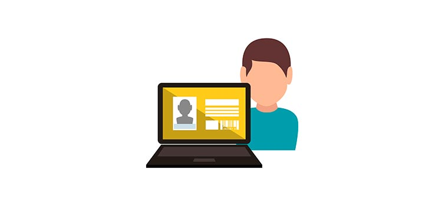
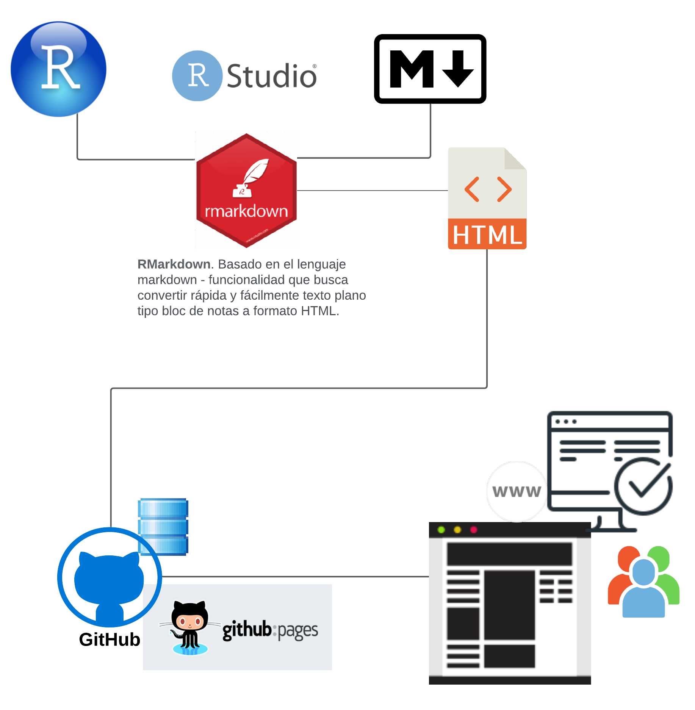
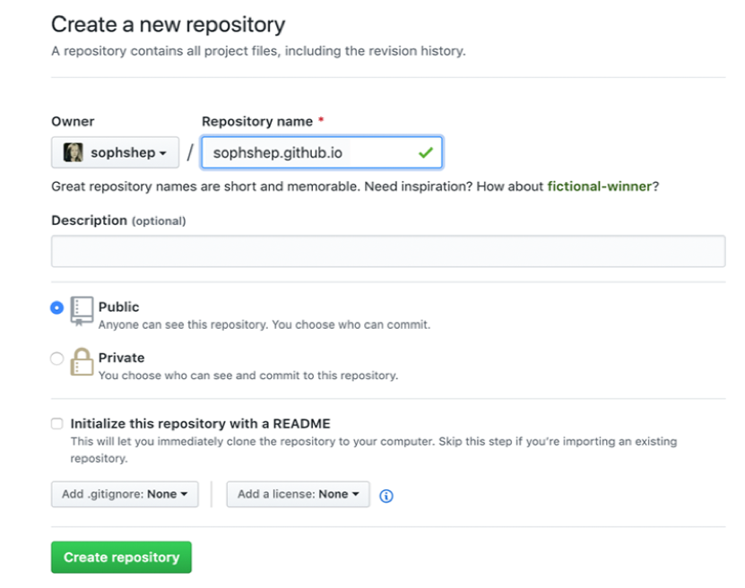

```{r setup, include=FALSE}
knitr::opts_chunk$set(echo = FALSE)
```


```{css, echo = FALSE}
/* From https://github.com/yihui/xaringan/issues/147  */
.scroll-output {
  height: 80%;
  overflow-y: scroll;
}
/* https://stackoverflow.com/questions/50919104/horizontally-scrollable-output-on-xaringan-slides */
pre {
  max-width: 100%;
  overflow-x: scroll;
}
```

## Contenido

1. Introducción
2. ¿Qué es Git y GitHub?
3. ¿Qué es GitHub Pages?
4. Creación del sitio web  
  4.1 Crear cuenta de usuario en GitHub  
  4.2 Crear un repositorio  
  4.3 Personalización del sitio web  

 
---

# GitHub Pages

## Objetivo
Al finalizar la lección, tendremos disponible un sitio web construido en GitHub/GitHub Pages donde podremos mostrar nuestra información académica, datos relevantes sobre nuestros proyectos y cualquier otro dato que nosotros deseemos.

```{r, out.width = "550px",fig.align='center'}

```

---

## Introducción

Imaginemos que deseamos mostrar al público un poco de información sobre nosotros, nuestros proyectos, trabajos realizados, experiencia, áreas de interes y muchas cosas más.

.full-width[.content-box-red[Vivimos en un momento en que todo lo que buscamos lo encontramos de manera online, tener un página web personal nos ayudará de escaparate digital para mostrar el área en que nos desarrollamos, nuestros trabajo y en qué somos especialistas.]]


```{r, out.width = "550px",fig.align='center'}

```
---

###  Ventajas de contar con una página web personal

- Tener un **espacio propio** en el mundo **online**, _controlado por ti_. Es posiblemente el único espacio online en el que mandas tú. Tú decides la imagen que tendrá, _qué contenido va a aparecer_ y cuál no, si lo actualizas o no, etc.

- Lograremos tener __“visibilidad”__. Tener una propia página web facilita que la audiencia o las personas que buscan información de nosotros nos encuentren, y conozcan de nuestros proyectos e intereses.

```{r, out.width = "550px",fig.align='center'}

```

---

## ¿Dónde creo mi página web?

Para hacer disponible a todos nuestra página web implica que esta deba estar almacenada en un sistema de alojamiento web (**hosting**). 

El servicio de hosting provee a los usuarios de internet un sistema para poder almacenar información, imágenes, vídeo, o cualquier contenido accesible vía web.

Existen muchos disponibles y para usar algunos de ellos se requiere pagar una cuota. Sin embargo, existen alternativas de uso libre como el caso de __GitHub/GitHub pages__.


```{r, out.width = "450px",fig.align='center'}
knitr::include_graphics("img/hosting.jpeg")
```
---

## ¿Qué necesito para construir mi página web?

```{r, out.width = "530px",fig.align='center'}

```
---

## ¿Qué es GitHub Pages?

Entre las muchas características con las que cuenta GitHub se encuentra _GitHub Pages_.

_GitHub Pages_ es un servicio de alojamiento de un __sitio web estático__ que toma archivos __HTML__, CSS y JavaScript directamente desde un repositorio en GitHub.

```{r, out.width = "450px",fig.align='center'}

```
---

## ¡Comencemos!: Creación del sitio web 

_Paso 1:_  Iniciar sesión en GitHub

_Paso 2:_ Crear un repositorio para nuestra página web

*  Ir a la esquina superior derecha, hacer clic en el ícono "+" y seleccionar la opción _New repository_

* Indicar el nombre del repositorio y una descripción (opcional): tu repositorio se debe nombrar __[username].github.io__, por ejemplo: _shirleyah.github.io_

* Visibilidad: _Públic_

```{r, out.width = "400px",fig.align='center'}

```
---

_Paso 3:_ Crear el archivo index.Rmd

* Abrir el programa RStudio  

* Crear un archivo R Markdown, como Título: Mi sitio personal y Autor: [Nombre completo]   
  

* Guardar el documento en nuestra máquina con el nombre index.Rmd   
Se sugiere definir una carpeta para organizar todos los elementos que contemplará la página web.

* Revisar la estructura del archivo rmd (cabecera: título, autor y fecha, sentencias de R, contenido)

---


## Creación del sitio web

_Paso 4:_ Crear el archivo html

* Ejecutar el arhivo Rmd con la opción Knit para generar el html  

* Revisar el despligue de la página web  

  El contenido se encuentra etiquetado y con formato especial, por ejemplo: negrita, italica, links, tablas, imágenes, etc.

* Asignar un tema a la página web _theme:_ "default", "cerulean", "journal", "flatly", "darkly", "readable", "spacelab", "united", "cosmo", "lumen", "paper", "sandstone", "simplex", "yeti".

Nota: en la carpeta donde guardamos el archivo Rmd se generará el html.

---


## Creación del sitio web

_Paso 5:_ Editar el contenido del index.Rmd

* Cambiar el título por nuestro nombre completo. Comentar el campo author y date (usar --). Agregar las siguientes secciones y registrar los datos correspondientes:

Datos personales  
Fecha de nacimiento:  
Edad:  
Nacionalidad:  
    
Formación Académica  
Maestría en [nombre]  
[Período]  
Licenciatura en [nombre]  
[Período]  
    
Contacto y redes sociales  
Correo electrónico:  
Facebook: [username]  
Twitter: [username]  
    
 Nota: usar el etiquetado markdown para definir secciones, viñetas, etc.
---

## Creación del sitio web

_Paso 6:_ Subir los cambios a GitHub

* Ir a GitHub

* Hacer clic en el enlace __Uploading an existing files__

* Localizar/arrastrar los archivos index.Rmd e index.html a GitHub

* Agregar un comentario

* Hacer clic en el botón __Commit changes__ para confirmar los cambios 

---


## Creación del sitio web

_Paso 7:_ Configurar el sitio web en GitHub

* En GitHub, dentro del repositorio creado hacer clic en la opción __Settings__

* En el panel izquierdo, hacer clic en __Pages__

* Ir a la opción __Source__ y seleccionar la rama _main_ y directorio _root_

* Con esto obtendremos la url de nuestro sitio web, por ejemplo: https://shirleyah.github.io/

---


## Creación del sitio web

_Paso 8:_ Agregar links a nuestras redes sociales

* Ir al archivo Rmd y agregar el link a nuestro perfil de Facebook y Twitter

* Usar la sintaxis : ` [Link](url) `  

Ejemplo:

` [shirley.alquicira.1](https://www.facebook.com/shirley.alquicira.1) `

` [shirley_ah](https://twitter.com/shirley_ah) ` 

---
## Creación del sitio web  

_Paso 9:_ Agregar imágenes a la página web

* Descargar los logos de Facebook y Twitter. Se recomienda crear una carpeta __/img__

* Agregar logos a las secciones correspondientes

* Usar la sintaxis : `  `

Ejemplo:  

`  Twitter: `

* Subir los cambios a GitHub (Add file -> Upload files).  

Nota: arrastrar los archivos a GitHub.
---

## Templates  

Exsten muchos diseños o templates creados por otras personas o grupos que podemos reutilizar para diseñar nuesto sitio web.

[GitHub Pages themes](https://github.com/pages-themes)
---


